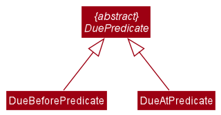
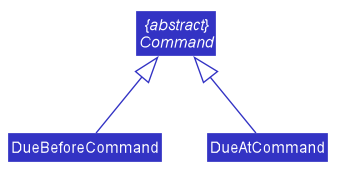

* Table of Contents
{:toc}

--------------------------------------------------------------------------------------------------------------------

## **Setting up, getting started**

Refer to the guide [_Setting up and getting started_](SettingUp.md).

--------------------------------------------------------------------------------------------------------------------

## **Design**

### Architecture

**How the architecture components interact with each other**

### UI component

**API** :
[`Ui.java`](https://github.com/AY2021S1-CS2103T-F12-4/tp/blob/master/src/main/java/seedu/address/ui/Ui.java)

### Logic component

**API** :
[`Logic.java`](https://github.com/AY2021S1-CS2103T-F12-4/tp/blob/master/src/main/java/seedu/address/logic/Logic.java)

### Model component

**API** : [`Model.java`](https://github.com/AY2021S1-CS2103T-F12-4/tp/blob/master/src/main/java/seedu/address/model/Model.java)

### Storage component

**API** : [`Storage.java`](https://github.com/AY2021S1-CS2103T-F12-4/tp/blob/master/src/main/java/seedu/address/storage/Storage.java)

### Common classes

--------------------------------------------------------------------------------------------------------------------

## **Implementation**

This section describes some noteworthy details on how certain features are implemented.

### Filter tasks (dueBy and dueBefore) feature

#### Implementation

#####Parser: 

* `DueBeforeCommandParser` implements `Parser<DueBeforeCommand>`
 
    * It checks for the phrase `itemsDueBefore` and parses the input after the prefixes: date `date/` and time `time/`. 
    * If the input are in the correct date and time format, a new DueBeforePredicate object is created and passed to a new DueBeforeCommand constructor.
    
    
* `DueByCommandParser` implements `Parser<DueByCommand>`

    * It checks for the phrase `itemsDueBy` and parses the content after the prefixes: date `date/` and time `time/`.
    * If the input are in the correct date and time format, a new DueByPredicate object is created and passed to a new DueByCommand constructor.

#####Predicate:

The way dueBy and dueBefore works is very similar, the difference only being the dueBefore and dueBy predicate.

`DueBeforePredicate` and `DueByPredicate` extends `DuePredicate`.

* `DueBeforePredicate` compares the LocalDateTime input and every task's LocalDateTime, and returns true if the task's LocalDateTime *is before* the input's LocalDateTime.
* `DueByPredicate` compares the LocalDateTime input and every task's LocalDateTime, and returns true if the task's LocalDateTime *equals* the input's LocalDateTime.

#####Command: 

* `DueBeforeCommand` and `DueByCommand` extends `Command`.
* The command will be executed with the `Model`, which will update the `FilteredTaskList` based on the `DueByPredicate`/`DueBeforePredicate`
* If it is successful, it will return a `CommandResult` with a successful message to the UI.

The following sequence diagram shows how the dueBy filtering works:

The following activity diagram shows what happens when the user enters the filter command:

#### Design consideration:

##### Aspect: How dueBy and dueBefore executes

After implementing the task operations, there is `FilteredTaskList` which we can utilise to filter tasks.

By using the same function, we can prevent duplication of code.

Furthermore, we have adhered a similar design to the task's operations (Using of Command, Parser classes) to maintain code consistency.

--------------------------------------------------------------------------------------------------------------------

## **Documentation, logging, testing, configuration, dev-ops**

* [Documentation guide](Documentation.md)
* [Testing guide](Testing.md)
* [Logging guide](Logging.md)
* [Configuration guide](Configuration.md)
* [DevOps guide](DevOps.md)

--------------------------------------------------------------------------------------------------------------------

## **Appendix: Requirements**

### Product scope

**Target user profile**:

* has a need to manage a significant number of contacts
* prefer desktop apps over other types
* can type fast
* prefers typing to mouse interactions
* is reasonably comfortable using CLI apps

**Value proposition**:
* Students can keep track of tasks from all modules they take efficiently.
* Manage contacts faster than a typical mouse/GUI driven app.
* Increase school productivity.
* An all in one app that makes student's life easier.

### User stories

Priorities: High (must have) - `* * *`, Medium (nice to have) - `* *`, Low (unlikely to have) - `*`

| Priority | As a …​                                    | I want to …​                     | So that I can…​                                                        |
| -------- | ------------------------------------------ | ------------------------------ | ---------------------------------------------------------------------- |
| `* * *`  | new user                                   | see usage instructions         | refer to instructions when I forget how to use the App                 |
| `* * *`  | user                                       | add a new person               |                                                                        |
| `* * *`  | user                                       | delete a person                | remove entries that I no longer need                                   |
| `* * *`  | user                                       | find a person by name          | locate details of persons without having to go through the entire list |
| `* * *`  | forgetful student                          | add and remove to do's         | remember to complete important tasks for projects or assignments |
| `* * *`  | student                                    | mark to do's as done           | remember the tasks or assignments that I have completed          |
| `* * *`  | forgetful student                           | view details of a to do        | recall the details of an assignment or task.                     |
| ` * * ` | forgetful student                           |  search for contacts under a particular tag  | find people I'm working with easily
| `* *`    | user                                       | hide private contact details   | minimize chance of someone else seeing them by accident                |
| `* *`    | disorganised student                                       | add and remove collaborative links (Google Drive, and many more)   | find the collaborative link for the project easily                |
| `* *`    | forgetful/disorganised student | search what tasks/meetings are due soon or by a specific date/time (filter) | remember to finish before the deadline|
| `*`      | user with many contacts in the Lifebook | sort persons by name           | locate a person easily                                                 |
| `*`      | disorganised student |  add, remove, and view zoom links for meetings          | remember my Zoom Links                                          |

*{More to be added}*

### Use cases

(For all use cases below, the **System** is the `Lifebook` and the **Actor** is the `user`, unless specified otherwise)

**Use case: Delete a person**

**MSS**

1.  User requests to list persons
2.  Lifebook shows a list of persons
3.  User requests to delete a specific person in the list
4.  Lifebook deletes the person

    Use case ends.

**Extensions**

* 2a. The list is empty.

  Use case ends.

* 3a. The given index is invalid.

    * 3a1. Lifebook shows an error message.

      Use case resumes at step 2.

**Use case: Show contacts with a specific tag**

**MSS**

1.  User requests to list persons
2.  Lifebook shows a list of persons
3.  User requests to show all persons with a specific tag in the list
4.  Lifebook shows all the persons whose tag matching the tag searched

    Use case ends.

**Extensions**

* 2a. The list is empty.

  Use case ends.

* 3a. The given tag is empty or invalid.

    * 3a1. Lifebook shows an error message.

      Use case resumes at step 2.

**Use case: Add a To Do to the To Do List**

**MSS**
1. User requests to add a To Do and its details (i.e. description, date, and time) to the To Do list.
2. Lifebook acknowledges the request by adding the To Do to the To Do list.

    Use case ends.

**Extensions**

* 1a. User inputs the date or time of the To Do in the incorrect format.

    * 1a1. Lifebook shows an error message

    Use case restarts at step 1.

**Use case: Perform an action (remove, show, mark as done) on a To Do from the To Do list**

**MSS**
1.  User requests to list all To Do's
2.  Lifebook shows a list of To Do's
3.  User requests to perform an action on a specific To Do from the list
4.  Lifebook performs action on To Do.

    Use case ends.

**Extensions**

* 2a. The list is empty.

  Use case ends.

* 3a. The given index is invalid.

    * 3a1. Lifebook shows an error message.

      Use case resumes at step 2.

* 3b. The given action does not exist.

    * 3b1. Lifebook shows an error message.

     Use case resumes at step 2.

**Use case: Filter items due on a specific date/time**

**MSS**

1.  User requests to filter items due by/before a specified date/time
2.  Lifebook shows a list of items that fulfil the requirement.

    Use case ends.

**Extensions**

* 1a. The given index is invalid.

    * 1a1. Lifebook shows an error message.

      Use case restarts at step 1.

* 2a. The list is empty.

  Use case ends.

**Use case: Add or remove a collaborative link**

**MSS**

1. User requests a task to be given a link (GitHub Repo, Google Drive, etc).
2. Lifebook acknowledges the request by showing the requested task.
3. User requests to bind the link with the task.
4. Lifebook performs action on the task.

      Use case ends.

**Extensions**

* 1a. The given index is invalid.

    * 1a1. Lifebook shows an error message.

      Use case restarts at step 1.

* 2a. The list is empty.

* 3a. The task already has a link.

    * 3a1. Lifebook requests permission to override the existing link.

      Use case ends.
**Use case: Store and retrieve a meeting link**

**MSS**

1. User requests a task to be given a meeting link (Teams, Zoom, etc).
2. Lifebook acknowledges the request by attaching a link to the task.
3. User later requests to view meeting links associated with the task.
4. Lifebook shows the links associated with the task.

      Use case ends.

**Extensions**

* 1a. The given index is invalid.

    * 1a1. Lifebook shows an error message.

      Use case restarts at step 1.

* 2a. The list is empty.

* 3a. The task already has a link.

    * 3a1. Lifebook requests permission to override the existing link.

      Use case ends.

*{More to be added}*

### Non-Functional Requirements

1.  Should work on any _mainstream OS_ as long as it has Java `11` or above installed.
2.  Should be able to hold up to 1000 persons without a noticeable sluggishness in performance for typical usage.
3.  A user with above average typing speed for regular English text (i.e. not code, not system admin commands) should be able to accomplish most of the tasks faster using commands than using the mouse.
4.  Commands should be intuitive so that users can quickly remember the commands.

*{More to be added}*

### Glossary

* **Mainstream OS**: Windows, Linux, Unix, OS-X
* **Private contact detail**: A contact detail that is not meant to be shared with others

--------------------------------------------------------------------------------------------------------------------

## **Appendix: Instructions for manual testing**

Given below are instructions to test the app manually.

:information_source: **Note:** These instructions only provide a starting point for testers to work on;
testers are expected to do more *exploratory* testing.

### Launch and shutdown

1. Initial launch

   1. Download the jar file and copy into an empty folder

   1. Double-click the jar file Expected: Shows the GUI with a set of sample contacts. The window size may not be optimum.

1. Saving window preferences

   1. Resize the window to an optimum size. Move the window to a different location. Close the window.

   1. Re-launch the app by double-clicking the jar file. 
       Expected: The most recent window size and location is retained.

1. _{ more test cases …​ }_

### Deleting a person

1. Deleting a person while all persons are being shown

   1. Prerequisites: List all persons using the `list` command. Multiple persons in the list.

   1. Test case: `delete 1` 
      Expected: First contact is deleted from the list. Details of the deleted contact shown in the status message. Timestamp in the status bar is updated.

   1. Test case: `delete 0` 
      Expected: No person is deleted. Error details shown in the status message. Status bar remains the same.

   1. Other incorrect delete commands to try: `delete`, `delete x`, `...` (where x is larger than the list size) 
      Expected: Similar to previous.

1. _{ more test cases …​ }_

### Saving data

1. Dealing with missing/corrupted data files

   1. _{explain how to simulate a missing/corrupted file, and the expected behavior}_

1. _{ more test cases …​ }_
